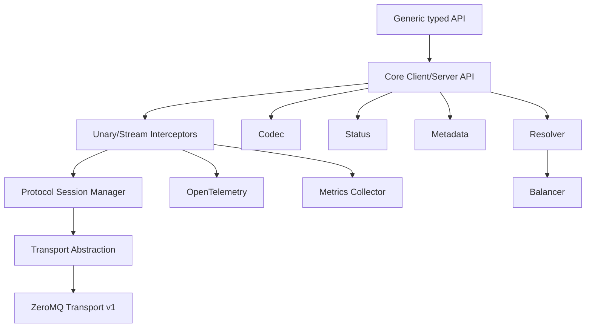

# zrpc Core Redesign Design

Date: 2026-07-10

## Status

Approved design for a v1 core rewrite.

## Context

The current zrpc implementation couples RPC semantics directly to ZeroMQ sockets, reflection-based registration, global server state, and cluster-oriented broker behavior. Previous review identified issues around unbounded ZeroMQ queues, missing send failure visibility, incomplete stream state handling, weak error propagation, and hard-to-extend transport boundaries.

The new direction is a breaking redesign. Compatibility with the existing API is not required. The repository and a few product concepts remain, but the core implementation should be rewritten around explicit interfaces, testable protocol state, and a transport abstraction.

## Goals

- Provide a robust Go-to-Go RPC framework.
- Support four RPC modes:
  - unary request-response
  - client streaming
  - server streaming
  - bidirectional streaming
- Use explicit handler/client APIs as the stable core.
- Provide generic typed helpers for business ergonomics.
- Abstract transport so ZeroMQ is only the first implementation.
- Implement ZeroMQ transport in v1.
- Leave clear extension points for HTTP/2, QUIC, and TCP transports.
- Support pluggable unary and stream middleware.
- Support OpenTelemetry tracing directly.
- Support pluggable metrics collection without binding to Prometheus.
- Support a stable status-code error model with details.
- Implement internal per-stream flow control and backpressure.
- Expose minimal resolver/balancer interfaces for future cluster support.
- Keep v1 single-node: one server endpoint, many clients.

## Non-Goals for v1

- No compatibility with old `RegisterServer`, `Run`, `Decorator`, broker, or proxy APIs.
- No cluster runtime behavior.
- No service discovery implementation for etcd, consul, or zookeeper.
- No node-to-node forwarding.
- No client-side multi-node load balancing beyond a static single endpoint.
- No cross-language SDK.
- No IDL or code generation.
- No automatic retry or hedging.
- No transport-layer TLS/mTLS for ZeroMQ.
- No Prometheus exporter in core.
- No public per-message middleware API, though hooks are reserved internally.

## Key Decisions

### API Style

Use explicit Handler/Client APIs as the core. Provide generic typed helpers on top.

Rationale:

- The core remains simple, inspectable, and testable.
- Middleware, stream lifecycle, status, metadata, and transport logic do not depend on reflection.
- Business users still get type-friendly Go APIs through generic helpers.
- Reflection-based proxy sugar can be added later without polluting core design.

### Language Scope

v1 is Go-to-Go only.

Protocol and codec interfaces should not intentionally lock the framework to `gob` or Go-private reflection data, but v1 does not need cross-language SDKs, IDL, or codegen.

### Codec

Use `msgpack` as the default codec. Provide `json` as a debug codec. Keep a `Codec` interface for future protobuf support.

```go
type Codec interface {
    Name() string
    Marshal(v any) ([]byte, error)
    Unmarshal(data []byte, v any) error
}
```

### Transport Strategy

Use transport abstraction. Implement ZeroMQ first. Reserve room for HTTP/2, QUIC, and TCP.

Transport trade-offs:

| Transport | Best fit | Main strength | Main cost |
| --- | --- | --- | --- |
| ZeroMQ | Internal high-performance messaging and custom topology | Native message model and ROUTER/DEALER flexibility | RPC lifecycle, flow control, and observability must be implemented by zrpc |
| HTTP/2 | gRPC-like service RPC | Mature stream/header/TLS/proxy ecosystem | TCP connection-level head-of-line blocking |
| QUIC | future weak-network or HTTP/3-like RPC | independent streams, TLS 1.3, connection migration | UDP operations and implementation complexity |
| TCP | minimal dependency internal transport | simple and fully controllable | framing, mux, flow control, TLS, and tooling must be built |

## Package Layout

Proposed package structure:

```text
zrpc/
  codec/          codec interface and msgpack/json implementations
  metadata/       RPC metadata map and helpers
  status/         status code, RPC error, details
  protocol/       frames, stream state, window/update semantics
  transport/      Transport, Listener, Conn, Stream interfaces
  transport/zmq/  ZeroMQ v1 transport
  interceptor/    unary and stream middleware chains
  trace/          OpenTelemetry integration
  metrics/        pluggable metrics collector
  resolver/       StaticResolver and future resolver interface
  balancer/       PickFirstBalancer and future balancer interface
  server/         Server and handler registration
  client/         Client, Invoke, stream creation, connection management
  typed/          generic helper APIs, or root-level generic helpers
```

Core dependency direction:

```text
typed helpers
  -> client/server core
  -> interceptor/status/metadata/codec/protocol
  -> transport abstraction
  -> transport/zmq
```

Transport packages must not depend on business handlers, typed helpers, or reflection registration.

## High-Level Architecture



## Core API

### Server

```go
srv := zrpc.NewServer(
    zrpc.WithTransport(zmq.NewServerTransport("tcp://0.0.0.0:9000")),
    zrpc.WithCodec(codec.Msgpack()),
    zrpc.WithUnaryInterceptor(authUnary, logUnary),
    zrpc.WithStreamInterceptor(traceStream),
)

srv.HandleUnary("user.Get", zrpc.UnaryHandlerFunc(func(ctx context.Context, req *zrpc.Request) (*zrpc.Response, error) {
    var in GetUserReq
    if err := req.Decode(&in); err != nil {
        return nil, status.Error(codes.InvalidArgument, err.Error())
    }
    out := GetUserResp{}
    return zrpc.NewResponse(ctx, out), nil
}))

err := srv.Serve(ctx)
```

### Client

```go
cli := zrpc.NewClient(
    zrpc.WithTarget("tcp://127.0.0.1:9000"),
    zrpc.WithTransport(zmq.NewClientTransport()),
    zrpc.WithCodec(codec.Msgpack()),
)

req := zrpc.NewRequest("user.Get", GetUserReq{ID: "u1"})
resp, err := cli.Invoke(ctx, req)

var out GetUserResp
err = resp.Decode(&out)
```

### Typed Helpers

```go
zrpc.HandleUnary[GetUserReq, GetUserResp](srv, "user.Get",
    func(ctx context.Context, req *GetUserReq) (*GetUserResp, error) {
        return &GetUserResp{}, nil
    },
)

resp, err := zrpc.Invoke[GetUserReq, GetUserResp](ctx, cli, "user.Get", &GetUserReq{
    ID: "u1",
})
```

Typed stream helpers:

```go
zrpc.HandleClientStream[UploadChunk, UploadResult](srv, "file.Upload", uploadHandler)
zrpc.HandleServerStream[LogRequest, LogLine](srv, "log.Tail", tailHandler)
zrpc.HandleBidiStream[ChatMessage, ChatMessage](srv, "chat.Stream", chatHandler)
```

## Request and Response

```go
type Request struct {
    Method   string
    Metadata metadata.MD
    Body     []byte
    Codec    codec.Codec
}

type Response struct {
    Metadata metadata.MD
    Body     []byte
    Codec    codec.Codec
}
```

`Request.Decode` and `Response.Decode` use the bound codec. Metadata carries trace context, auth, request IDs, tenant IDs, and user-defined keys.

## Stream API

Core stream:

```go
type Stream interface {
    Context() context.Context
    Method() string
    Metadata() metadata.MD

    Send(ctx context.Context, msg any) error
    Recv(ctx context.Context, msg any) error

    CloseSend(ctx context.Context) error
    CloseRecv(ctx context.Context) error
    Reset(ctx context.Context, err error) error
}
```

Typed stream wrappers:

```go
type ClientStream[Req any, Resp any] interface {
    Send(ctx context.Context, req *Req) error
    CloseAndRecv(ctx context.Context) (*Resp, error)
}

type ServerStream[Req any, Resp any] interface {
    Send(ctx context.Context, resp *Resp) error
    RecvRequest() *Req
}

type BidiStream[Req any, Resp any] interface {
    Send(ctx context.Context, resp *Resp) error
    Recv(ctx context.Context) (*Req, error)
    CloseSend(ctx context.Context) error
}
```

## Protocol

### RPC Modes

Unary:

```text
REQUEST -> RESPONSE
```

Client streaming:

```text
REQUEST_OPEN
STREAM_DATA client->server
STREAM_DATA client->server
STREAM_END client->server
RESPONSE server->client
```

Server streaming:

```text
REQUEST_OPEN
STREAM_DATA server->client
STREAM_DATA server->client
STREAM_END server->client
RESPONSE server->client
```

Bidirectional streaming:

```text
REQUEST_OPEN
STREAM_DATA client->server and server->client concurrently
STREAM_END client->server
STREAM_END server->client
RESPONSE server->client
```

### Frames

```go
type FrameType uint8

const (
    FrameRequest FrameType = iota + 1
    FrameResponse
    FrameData
    FrameWindowUpdate
    FrameEnd
    FrameReset
    FramePing
    FrameGoAway
)

type Frame struct {
    Type      FrameType
    StreamID  string
    Seq       uint64
    Direction Direction
    Metadata  metadata.MD
    Payload   []byte
    Status    *status.Status
}
```

### Flow Control

v1 implements internal per-stream backpressure:

- Each stream has send and receive windows.
- Windows are byte-based.
- `Send` blocks when the send window is exhausted.
- `Recv` consumption sends `FrameWindowUpdate`.
- Each stream has max in-flight bytes.
- Each connection has max in-flight bytes.
- Each message has max size.
- Exceeding limits returns `ResourceExhausted`.
- Context cancellation or deadline sends `FrameReset` or `FrameEnd` as appropriate.

User APIs expose simple `Send` and `Recv`; window details remain internal.

### Half-Close

Bidirectional streaming requires true half-close semantics:

- `CloseSend` closes only the local send direction.
- The peer observes `FrameEnd(direction)` and its `Recv` returns EOF/status.
- `CloseRecv` means the local side will no longer accept receive frames and usually triggers drain or reset.
- `Reset` aborts the whole stream.
- The stream is fully closed only when both directions are closed and the final response is handled.

## Transport Abstraction

```go
type Transport interface {
    Dial(ctx context.Context, endpoint Endpoint, opts DialOptions) (Conn, error)
    Listen(endpoint Endpoint, opts ListenOptions) (Listener, error)
    Name() string
}

type Listener interface {
    Accept(ctx context.Context) (Conn, error)
    Close(ctx context.Context) error
}

type Conn interface {
    ID() string
    LocalEndpoint() Endpoint
    RemoteEndpoint() Endpoint

    OpenStream(ctx context.Context, method string, md metadata.MD) (TransportStream, error)
    AcceptStream(ctx context.Context) (TransportStream, error)

    Close(ctx context.Context) error
    Drain(ctx context.Context) error
}

type TransportStream interface {
    ID() string
    SendFrame(ctx context.Context, frame *protocol.Frame) error
    RecvFrame(ctx context.Context) (*protocol.Frame, error)
    Close(ctx context.Context) error
    Reset(ctx context.Context, st *status.Status) error
}
```

Endpoint:

```go
type Endpoint struct {
    Transport string
    Address   string
}
```

Examples:

- `Endpoint{Transport: "zmq", Address: "tcp://127.0.0.1:9000"}`
- Future: `Endpoint{Transport: "http2", Address: "https://svc.internal:9443"}`

## ZeroMQ Transport v1

Use `DEALER` on clients and `ROUTER` on the server.

Frame mapping:

```text
Client DEALER:
  [encoded protocol.Frame]

Server ROUTER:
  [clientIdentity][encoded protocol.Frame]
```

Rules:

- One owner goroutine accesses each ZeroMQ socket.
- `SendFrame` receives success or failure from the owner goroutine.
- `ROUTER_MANDATORY` is enabled.
- `IMMEDIATE` is enabled where supported and appropriate.
- `SNDHWM` and `RCVHWM` are finite.
- `LINGER` is finite.
- Close and drain use done channels and wait groups, not fixed sleeps.
- The protocol layer multiplexes many stream IDs over one ZeroMQ connection.

ZeroMQ v1 does not implement:

- PUB/SUB state broadcast
- node-to-node routing
- broker devices
- cluster peer state
- CurveZMQ

## Resolver and Balancer

v1 exposes minimal extension interfaces but only implements single-endpoint behavior.

```go
type Resolver interface {
    Resolve(ctx context.Context, target string) ([]Endpoint, error)
    Watch(ctx context.Context, target string) (<-chan Update, error)
}

type Balancer interface {
    Pick(ctx context.Context, endpoints []Endpoint) (Endpoint, error)
}
```

v1 implementations:

- `StaticResolver`
- `PickFirstBalancer`

No etcd, consul, zookeeper, or multi-node watch is implemented in v1.

## Middleware

Unary:

```go
type UnaryHandler interface {
    HandleUnary(ctx context.Context, req *Request) (*Response, error)
}

type UnaryInterceptor func(ctx context.Context, req *Request, next UnaryHandler) (*Response, error)
```

Stream:

```go
type StreamHandler interface {
    HandleStream(ctx context.Context, stream Stream) error
}

type StreamInterceptor func(ctx context.Context, stream Stream, next StreamHandler) error
```

Middleware can:

- read and write metadata
- inspect method, stream ID, and peer info
- inject principal/auth state into context
- log requests and stream lifecycle
- record metrics
- set trace attributes
- recover panics
- rate limit or reject calls

Per-message hooks are reserved:

```go
type MessageHook interface {
    OnSend(ctx context.Context, frame *protocol.Frame) error
    OnRecv(ctx context.Context, frame *protocol.Frame) error
}
```

These are not a public v1 business-facing API unless needed internally.

## OpenTelemetry

v1 directly uses OpenTelemetry.

Behavior:

- Client unary creates a client span.
- Server unary extracts metadata and creates a server span.
- Streams create one lifetime span.
- Stream messages are not individual spans by default.
- Message activity can be recorded as sampled span events.
- Trace context propagates through metadata using W3C tracecontext.
- Handler contexts contain the active server span.
- If the application does not configure a tracer provider, tracing remains no-op.

Suggested attributes:

```text
rpc.system = "zrpc"
rpc.service
rpc.method
rpc.stream_id
rpc.transport = "zmq"
rpc.status_code
net.peer.name
net.peer.port
```

## Metrics

v1 provides pluggable metrics hooks and a no-op default.

```go
type Collector interface {
    OnRPCStart(ctx context.Context, info RPCInfo)
    OnRPCFinish(ctx context.Context, info RPCInfo, st *status.Status, dur time.Duration)
    OnStreamEvent(ctx context.Context, event StreamEvent)
    OnTransportEvent(ctx context.Context, event TransportEvent)
}
```

Metrics events should cover:

- request count
- request latency
- status code
- active RPCs
- active streams
- stream sent and received messages
- stream sent and received bytes
- backpressure wait duration
- window update count
- transport send errors
- transport connect/disconnect errors
- panic count

Prometheus and OpenTelemetry metrics adapters can be added later.

## Security

v1 does not provide ZeroMQ transport-layer encryption.

Security model:

- Application-level authentication is implemented through middleware.
- Metadata carries bearer token, API key, signatures, tenant ID, or custom credentials.
- Auth middleware injects a principal into context.
- Missing authentication returns `Unauthenticated`.
- Authorization failure returns `PermissionDenied`.

```go
type Principal struct {
    Subject string
    Claims  map[string]string
}

func PrincipalFromContext(ctx context.Context) (*Principal, bool)
func ContextWithPrincipal(ctx context.Context, p *Principal) context.Context
```

Transport security seam:

```go
type SecurityConfig struct {
    TLSConfig any
    Auth      AuthConfig
}
```

HTTP/2 and QUIC transports can later support TLS/mTLS. ZeroMQ Curve support is deferred.

## Status and Error Model

Use a stable RPC status code model:

```go
type Code int

const (
    OK Code = iota
    Canceled
    Unknown
    InvalidArgument
    DeadlineExceeded
    NotFound
    AlreadyExists
    PermissionDenied
    ResourceExhausted
    FailedPrecondition
    Aborted
    OutOfRange
    Unimplemented
    Internal
    Unavailable
    DataLoss
    Unauthenticated
)
```

API:

```go
status.Error(code, message)
status.FromError(err)
status.Code(err)
status.WithDetails(err, details...)
```

Mappings:

- `context.Canceled` -> `Canceled`
- context deadline -> `DeadlineExceeded`
- codec decode failure -> `InvalidArgument`
- unknown method -> `Unimplemented`
- flow-control limit -> `ResourceExhausted`
- transport disconnect -> `Unavailable`
- auth missing -> `Unauthenticated`
- auth denied -> `PermissionDenied`
- handler panic -> `Internal`

## Configuration

Server options:

```go
type ServerOptions struct {
    Transport transport.Transport
    Codec codec.Codec
    UnaryInterceptors []UnaryInterceptor
    StreamInterceptors []StreamInterceptor
    Metrics metrics.Collector
    TracerProvider trace.TracerProvider

    MaxConcurrentStreams int
    MaxMessageSize int
    InitialStreamWindow int
    MaxConnInFlightBytes int
    GracefulShutdownTimeout time.Duration
}
```

Client options:

```go
type ClientOptions struct {
    Transport transport.Transport
    Resolver resolver.Resolver
    Balancer balancer.Balancer
    Codec codec.Codec
    UnaryInterceptors []UnaryInterceptor
    StreamInterceptors []StreamInterceptor
    Metrics metrics.Collector
    TracerProvider trace.TracerProvider

    DefaultTimeout time.Duration
    MaxMessageSize int
    InitialStreamWindow int
    MaxConnInFlightBytes int
}
```

ZeroMQ options:

```go
type ZMQOptions struct {
    SndHWM int
    RcvHWM int
    Linger time.Duration
    Immediate bool
    RouterMandatory bool
    SendQueueSize int
    RecvQueueSize int
}
```

Defaults must be conservative:

- finite HWM
- finite linger
- max message size
- max stream window
- max connection in-flight bytes
- no-op metrics collector and tracer behavior when unset

## Testing Strategy

### Unit Tests

- codec msgpack/json round trips
- metadata copy/merge/canonicalization
- status encode/decode and `FromError`
- interceptor ordering and error propagation
- resolver and balancer behavior
- protocol frame encode/decode
- stream state machine
- window update and backpressure
- context cancel and deadline handling
- half-close behavior

### Fake Transport Tests

The client/server and protocol layers must be testable without ZeroMQ.

Fake transport should simulate:

- send error
- receive error
- delayed frames
- reset frames
- out-of-order frames
- peer close
- slow receiver

### ZeroMQ Integration Tests

- unary success
- unary handler error
- unknown method
- client streaming
- server streaming
- bidirectional streaming
- concurrent unary calls
- concurrent streams
- slow receiver backpressure
- server graceful shutdown
- client close while in-flight
- server close while in-flight
- transport unavailable mapping to `Unavailable`

### Race and Stress Tests

- `go test -race ./...`
- high concurrency unary calls
- high concurrency streams
- cancellation storms
- close while send/recv
- bounded-memory smoke test under slow consumer

## Migration Plan

Because v1 is not backward compatible, migration is replacement-style:

1. Build new packages without modifying old broker/multiplexer paths first.
2. Implement codec, status, metadata, and protocol tests.
3. Implement fake transport.
4. Implement server/client core against fake transport.
5. Implement stream state machine and flow control.
6. Implement ZeroMQ transport.
7. Add typed helper APIs.
8. Rewrite examples.
9. Rewrite README.
10. Remove or isolate old API once the new stack is complete.

## Future Work

- protobuf codec
- protobuf or custom IDL/codegen
- HTTP/2 transport
- QUIC transport
- raw TCP transport
- etcd/consul/zookeeper resolvers
- round-robin and least-request balancers
- health checking
- reflection/introspection
- retry and hedging with idempotency policy
- compression
- Prometheus adapter
- OpenTelemetry metrics adapter
- CurveZMQ or transport-layer security for ZeroMQ
- reflection-based interface/proxy sugar

## Approval Summary

Approved constraints:

- Use approach B: core rewrite while preserving the repository and a few concepts.
- v1 is Go-to-Go only.
- v1 uses explicit Handler/Client core APIs.
- Generic typed helpers are provided on top.
- v1 defaults to msgpack and includes json for debugging.
- v1 abstracts transport and implements ZeroMQ first.
- v1 does not implement cluster runtime behavior.
- v1 exposes minimal Resolver/Balancer interfaces with StaticResolver and PickFirstBalancer only.
- v1 supports unary and stream interceptors, with per-message hooks reserved.
- v1 directly supports OpenTelemetry with no-op behavior when not configured.
- v1 uses status codes with details.
- v1 implements internal per-stream flow control and backpressure.
- v1 uses application-level auth middleware and leaves transport TLS/mTLS to future transports.
- v1 has pluggable metrics hooks without binding to Prometheus.
