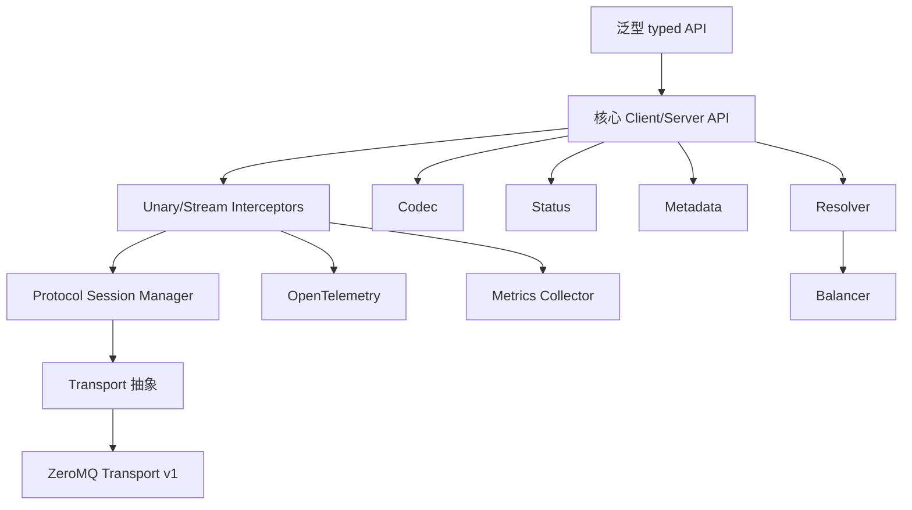

# zrpc 核心重构设计

日期：2026-07-10

## 状态

已确认的 v1 核心重构设计。

## 背景

当前 zrpc 实现把 RPC 语义直接耦合在 ZeroMQ socket、反射注册、全局服务状态和面向集群的 broker 行为上。前序 review 已经指出多类问题：ZeroMQ 队列无上限、发送失败不可见、stream 状态处理不完整、错误响应传播不可靠、transport 边界不清晰，后续扩展 HTTP/2、QUIC、TCP 或集群能力都会比较困难。

新的方向是破坏兼容性的重构。不要求兼容现有 API。仓库和少量产品概念保留，但核心实现需要围绕显式接口、可测试协议状态和 transport 抽象重新设计。

## 目标

- 提供一个稳健的 Go-to-Go RPC 框架。
- 支持四种 RPC 模式：
  - unary 请求-响应
  - client streaming 流式请求
  - server streaming 流式响应
  - bidirectional streaming 双向流式
- 使用显式 Handler/Client API 作为稳定核心。
- 在核心 API 之上提供泛型 typed helper，提升业务使用体验。
- 抽象 transport，让 ZeroMQ 只是第一个实现。
- v1 实现 ZeroMQ transport。
- 为后续 HTTP/2、QUIC、TCP transport 留出清晰扩展点。
- 支持可插拔 unary 和 stream middleware。
- 直接支持 OpenTelemetry 链路追踪。
- 支持可插拔 metrics collector，但不绑定 Prometheus。
- 使用稳定的 status code 错误模型，并支持 details。
- 实现内部 per-stream 流控和 backpressure。
- 暴露最小 Resolver/Balancer 接口，为后续集群能力预留扩展点。
- v1 保持单节点：一个 server endpoint，多个 client。

## v1 非目标

- 不兼容旧的 `RegisterServer`、`Run`、`Decorator`、broker 或 proxy API。
- 不实现集群运行时行为。
- 不实现 etcd、consul、zookeeper 服务发现。
- 不实现节点间转发。
- 不实现真正的多 endpoint client-side load balancing；v1 只支持静态单 endpoint。
- 不做跨语言 SDK。
- 不做 IDL 或代码生成。
- 不做自动 retry 或 hedging。
- ZeroMQ transport v1 不做传输层 TLS/mTLS。
- core 不内置 Prometheus exporter。
- 不公开 per-message middleware 作为 v1 业务 API，但内部保留 hook。

## 关键决策

### API 风格

核心使用显式 Handler/Client API，在上层提供泛型 typed helper。

理由：

- 核心简单、可检查、可测试。
- middleware、stream 生命周期、status、metadata 和 transport 逻辑不依赖反射。
- 业务用户仍能通过泛型 helper 获得类型友好的 Go API。
- 后续可以重新添加基于 interface/proxy 的反射语法糖，不污染底层设计。

### 语言范围

v1 只面向 Go-to-Go。

协议和 codec 接口不应故意绑定到 `gob` 或 Go 私有反射数据，但 v1 不需要跨语言 SDK、IDL 或 codegen。

### Codec

默认 codec 使用 `msgpack`。内置 `json` 作为调试 codec。保留 `Codec` 接口，后续可添加 protobuf。

```go
type Codec interface {
    Name() string
    Marshal(v any) ([]byte, error)
    Unmarshal(data []byte, v any) error
}
```

### Transport 策略

使用 transport 抽象。先实现 ZeroMQ，后续预留 HTTP/2、QUIC、TCP。

各 transport 的取舍：

| Transport | 适合场景 | 主要优势 | 主要成本 |
| --- | --- | --- | --- |
| ZeroMQ | 内网高性能消息和自定义拓扑 | 原生消息模型，ROUTER/DEALER 灵活 | RPC 生命周期、流控、可观测性需要 zrpc 自己补齐 |
| HTTP/2 | gRPC-like 服务 RPC | stream/header/TLS/proxy 生态成熟 | 受 TCP 连接级队头阻塞影响 |
| QUIC | 未来弱网或 HTTP/3-like RPC | 独立 stream、TLS 1.3、连接迁移 | UDP 运维和实现复杂度较高 |
| TCP | 极简依赖的内网 transport | 简单、完全可控 | framing、mux、流控、TLS、工具链都要自己实现 |

## 包结构

建议包布局：

```text
zrpc/
  codec/          codec 接口和 msgpack/json 实现
  metadata/       RPC metadata map 和辅助函数
  status/         status code、RPC error、details
  protocol/       frame、stream 状态机、window/update 语义
  transport/      Transport、Listener、Conn、Stream 接口
  transport/zmq/  ZeroMQ v1 transport
  interceptor/    unary 和 stream middleware 链
  trace/          OpenTelemetry 接入
  metrics/        可插拔 metrics collector
  resolver/       StaticResolver 和未来 resolver 接口
  balancer/       PickFirstBalancer 和未来 balancer 接口
  server/         Server 和 handler 注册
  client/         Client、Invoke、stream 创建、连接管理
  typed/          泛型 helper API，或放在根包作为泛型 helper
```

核心依赖方向：

```text
typed helpers
  -> client/server core
  -> interceptor/status/metadata/codec/protocol
  -> transport abstraction
  -> transport/zmq
```

transport 包不能依赖业务 handler、typed helper 或反射注册。

## 高层架构



## 核心 API

### Server

```go
srv := zrpc.NewServer(
    zrpc.WithTransport(zmq.NewServerTransport("tcp://0.0.0.0:9000")),
    zrpc.WithCodec(codec.Msgpack()),
    zrpc.WithUnaryInterceptor(authUnary, logUnary),
    zrpc.WithStreamInterceptor(traceStream),
)

srv.HandleUnary("user.Get", zrpc.UnaryHandlerFunc(func(ctx context.Context, req *zrpc.Request) (*zrpc.Response, error) {
    var in GetUserReq
    if err := req.Decode(&in); err != nil {
        return nil, status.Error(codes.InvalidArgument, err.Error())
    }
    out := GetUserResp{}
    return zrpc.NewResponse(ctx, out), nil
}))

err := srv.Serve(ctx)
```

### Client

```go
cli := zrpc.NewClient(
    zrpc.WithTarget("tcp://127.0.0.1:9000"),
    zrpc.WithTransport(zmq.NewClientTransport()),
    zrpc.WithCodec(codec.Msgpack()),
)

req := zrpc.NewRequest("user.Get", GetUserReq{ID: "u1"})
resp, err := cli.Invoke(ctx, req)

var out GetUserResp
err = resp.Decode(&out)
```

### Typed Helper

```go
zrpc.HandleUnary[GetUserReq, GetUserResp](srv, "user.Get",
    func(ctx context.Context, req *GetUserReq) (*GetUserResp, error) {
        return &GetUserResp{}, nil
    },
)

resp, err := zrpc.Invoke[GetUserReq, GetUserResp](ctx, cli, "user.Get", &GetUserReq{
    ID: "u1",
})
```

typed stream helper：

```go
zrpc.HandleClientStream[UploadChunk, UploadResult](srv, "file.Upload", uploadHandler)
zrpc.HandleServerStream[LogRequest, LogLine](srv, "log.Tail", tailHandler)
zrpc.HandleBidiStream[ChatMessage, ChatMessage](srv, "chat.Stream", chatHandler)
```

## Request 和 Response

```go
type Request struct {
    Method   string
    Metadata metadata.MD
    Body     []byte
    Codec    codec.Codec
}

type Response struct {
    Metadata metadata.MD
    Body     []byte
    Codec    codec.Codec
}
```

`Request.Decode` 和 `Response.Decode` 使用绑定的 codec。Metadata 承载 trace context、认证信息、request id、tenant id 和用户自定义键值。

## Stream API

核心 stream：

```go
type Stream interface {
    Context() context.Context
    Method() string
    Metadata() metadata.MD

    Send(ctx context.Context, msg any) error
    Recv(ctx context.Context, msg any) error

    CloseSend(ctx context.Context) error
    CloseRecv(ctx context.Context) error
    Reset(ctx context.Context, err error) error
}
```

typed stream 包装：

```go
type ClientStream[Req any, Resp any] interface {
    Send(ctx context.Context, req *Req) error
    CloseAndRecv(ctx context.Context) (*Resp, error)
}

type ServerStream[Req any, Resp any] interface {
    Send(ctx context.Context, resp *Resp) error
    RecvRequest() *Req
}

type BidiStream[Req any, Resp any] interface {
    Send(ctx context.Context, resp *Resp) error
    Recv(ctx context.Context) (*Req, error)
    CloseSend(ctx context.Context) error
}
```

## 协议

### RPC 模式

Unary：

```text
REQUEST -> RESPONSE
```

Client streaming：

```text
REQUEST_OPEN
STREAM_DATA client->server
STREAM_DATA client->server
STREAM_END client->server
RESPONSE server->client
```

Server streaming：

```text
REQUEST_OPEN
STREAM_DATA server->client
STREAM_DATA server->client
STREAM_END server->client
RESPONSE server->client
```

Bidirectional streaming：

```text
REQUEST_OPEN
STREAM_DATA client->server and server->client concurrently
STREAM_END client->server
STREAM_END server->client
RESPONSE server->client
```

### Frame

```go
type FrameType uint8

const (
    FrameRequest FrameType = iota + 1
    FrameResponse
    FrameData
    FrameWindowUpdate
    FrameEnd
    FrameReset
    FramePing
    FrameGoAway
)

type Frame struct {
    Type      FrameType
    StreamID  string
    Seq       uint64
    Direction Direction
    Metadata  metadata.MD
    Payload   []byte
    Status    *status.Status
}
```

### 流控

v1 实现内部 per-stream backpressure：

- 每个 stream 有 send window 和 receive window。
- window 按字节计算。
- `Send` 在 send window 耗尽时阻塞。
- `Recv` 消费数据后发送 `FrameWindowUpdate`。
- 每个 stream 有最大 in-flight bytes。
- 每个 connection 有最大 in-flight bytes。
- 每条消息有最大 size。
- 超限返回 `ResourceExhausted`。
- context cancel 或 deadline 触发时，根据状态发送 `FrameReset` 或 `FrameEnd`。

用户 API 只暴露简单的 `Send` 和 `Recv`，window 细节留在内部。

### Half-Close

双向流式必须支持真正的 half-close 语义：

- `CloseSend` 只关闭本端发送方向。
- 对端观察到 `FrameEnd(direction)` 后，其 `Recv` 返回 EOF/status。
- `CloseRecv` 表示本端不再接收 frame，通常触发 drain 或 reset。
- `Reset` 中止整个 stream。
- 只有两个方向都关闭，并且最终 response 已处理后，stream 才完全关闭。

## Transport 抽象

```go
type Transport interface {
    Dial(ctx context.Context, endpoint Endpoint, opts DialOptions) (Conn, error)
    Listen(endpoint Endpoint, opts ListenOptions) (Listener, error)
    Name() string
}

type Listener interface {
    Accept(ctx context.Context) (Conn, error)
    Close(ctx context.Context) error
}

type Conn interface {
    ID() string
    LocalEndpoint() Endpoint
    RemoteEndpoint() Endpoint

    OpenStream(ctx context.Context, method string, md metadata.MD) (TransportStream, error)
    AcceptStream(ctx context.Context) (TransportStream, error)

    Close(ctx context.Context) error
    Drain(ctx context.Context) error
}

type TransportStream interface {
    ID() string
    SendFrame(ctx context.Context, frame *protocol.Frame) error
    RecvFrame(ctx context.Context) (*protocol.Frame, error)
    Close(ctx context.Context) error
    Reset(ctx context.Context, st *status.Status) error
}
```

Endpoint：

```go
type Endpoint struct {
    Transport string
    Address   string
}
```

示例：

- `Endpoint{Transport: "zmq", Address: "tcp://127.0.0.1:9000"}`
- 未来：`Endpoint{Transport: "http2", Address: "https://svc.internal:9443"}`

## ZeroMQ Transport v1

client 使用 `DEALER`，server 使用 `ROUTER`。

Frame 映射：

```text
Client DEALER:
  [encoded protocol.Frame]

Server ROUTER:
  [clientIdentity][encoded protocol.Frame]
```

规则：

- 每个 ZeroMQ socket 只允许一个 owner goroutine 访问。
- `SendFrame` 必须能收到 owner goroutine 返回的成功或失败结果。
- 启用 `ROUTER_MANDATORY`。
- 在支持且合适的地方启用 `IMMEDIATE`。
- `SNDHWM` 和 `RCVHWM` 必须有限。
- `LINGER` 必须有限。
- Close 和 Drain 使用 done channel / wait group，不使用固定 sleep。
- protocol 层在一个 ZeroMQ connection 上复用多个 stream id。

ZeroMQ v1 不实现：

- PUB/SUB 状态广播
- 节点间路由
- broker device
- 集群 peer state
- CurveZMQ

## Resolver 和 Balancer

v1 暴露最小扩展接口，但只实现单 endpoint 行为。

```go
type Resolver interface {
    Resolve(ctx context.Context, target string) ([]Endpoint, error)
    Watch(ctx context.Context, target string) (<-chan Update, error)
}

type Balancer interface {
    Pick(ctx context.Context, endpoints []Endpoint) (Endpoint, error)
}
```

v1 实现：

- `StaticResolver`
- `PickFirstBalancer`

v1 不实现 etcd、consul、zookeeper 或多节点 watch。

## Middleware

Unary：

```go
type UnaryHandler interface {
    HandleUnary(ctx context.Context, req *Request) (*Response, error)
}

type UnaryInterceptor func(ctx context.Context, req *Request, next UnaryHandler) (*Response, error)
```

Stream：

```go
type StreamHandler interface {
    HandleStream(ctx context.Context, stream Stream) error
}

type StreamInterceptor func(ctx context.Context, stream Stream, next StreamHandler) error
```

middleware 可以：

- 读取和写入 metadata
- 检查 method、stream id 和 peer info
- 向 context 注入 principal/auth 状态
- 记录日志和 stream 生命周期
- 记录 metrics
- 设置 trace attributes
- recover panic
- 限流或拒绝调用

预留 per-message hook：

```go
type MessageHook interface {
    OnSend(ctx context.Context, frame *protocol.Frame) error
    OnRecv(ctx context.Context, frame *protocol.Frame) error
}
```

除非内部需要，否则它不是 v1 公开的业务 API。

## OpenTelemetry

v1 直接使用 OpenTelemetry。

行为：

- client unary 创建 client span。
- server unary 从 metadata 提取 trace context 并创建 server span。
- stream 创建一个覆盖整个生命周期的 span。
- stream message 默认不单独创建 span。
- message 活动可按采样策略记录为 span event。
- trace context 通过 metadata 传播，使用 W3C tracecontext。
- handler 收到的 context 包含当前 server span。
- 应用未配置 tracer provider 时，tracing 保持 no-op。

建议 attributes：

```text
rpc.system = "zrpc"
rpc.service
rpc.method
rpc.stream_id
rpc.transport = "zmq"
rpc.status_code
net.peer.name
net.peer.port
```

## Metrics

v1 提供可插拔 metrics hook，默认 no-op。

```go
type Collector interface {
    OnRPCStart(ctx context.Context, info RPCInfo)
    OnRPCFinish(ctx context.Context, info RPCInfo, st *status.Status, dur time.Duration)
    OnStreamEvent(ctx context.Context, event StreamEvent)
    OnTransportEvent(ctx context.Context, event TransportEvent)
}
```

metrics event 应覆盖：

- request count
- request latency
- status code
- active RPC
- active stream
- stream sent/received messages
- stream sent/received bytes
- backpressure wait duration
- window update count
- transport send error
- transport connect/disconnect error
- panic count

Prometheus 和 OpenTelemetry metrics adapter 后续再加。

## 安全

v1 不提供 ZeroMQ 传输层加密。

安全模型：

- 应用层认证通过 middleware 实现。
- metadata 承载 bearer token、API key、签名、tenant id 或自定义凭证。
- auth middleware 将 principal 注入 context。
- 缺少认证返回 `Unauthenticated`。
- 授权失败返回 `PermissionDenied`。

```go
type Principal struct {
    Subject string
    Claims  map[string]string
}

func PrincipalFromContext(ctx context.Context) (*Principal, bool)
func ContextWithPrincipal(ctx context.Context, p *Principal) context.Context
```

transport 安全扩展点：

```go
type SecurityConfig struct {
    TLSConfig any
    Auth      AuthConfig
}
```

HTTP/2 和 QUIC transport 后续可以支持 TLS/mTLS。ZeroMQ Curve 支持推迟。

## Status 和错误模型

使用稳定的 RPC status code 模型：

```go
type Code int

const (
    OK Code = iota
    Canceled
    Unknown
    InvalidArgument
    DeadlineExceeded
    NotFound
    AlreadyExists
    PermissionDenied
    ResourceExhausted
    FailedPrecondition
    Aborted
    OutOfRange
    Unimplemented
    Internal
    Unavailable
    DataLoss
    Unauthenticated
)
```

API：

```go
status.Error(code, message)
status.FromError(err)
status.Code(err)
status.WithDetails(err, details...)
```

映射规则：

- `context.Canceled` -> `Canceled`
- context deadline -> `DeadlineExceeded`
- codec decode failure -> `InvalidArgument`
- unknown method -> `Unimplemented`
- flow-control limit -> `ResourceExhausted`
- transport disconnect -> `Unavailable`
- auth missing -> `Unauthenticated`
- auth denied -> `PermissionDenied`
- handler panic -> `Internal`

## 配置

Server options：

```go
type ServerOptions struct {
    Transport transport.Transport
    Codec codec.Codec
    UnaryInterceptors []UnaryInterceptor
    StreamInterceptors []StreamInterceptor
    Metrics metrics.Collector
    TracerProvider trace.TracerProvider

    MaxConcurrentStreams int
    MaxMessageSize int
    InitialStreamWindow int
    MaxConnInFlightBytes int
    GracefulShutdownTimeout time.Duration
}
```

Client options：

```go
type ClientOptions struct {
    Transport transport.Transport
    Resolver resolver.Resolver
    Balancer balancer.Balancer
    Codec codec.Codec
    UnaryInterceptors []UnaryInterceptor
    StreamInterceptors []StreamInterceptor
    Metrics metrics.Collector
    TracerProvider trace.TracerProvider

    DefaultTimeout time.Duration
    MaxMessageSize int
    InitialStreamWindow int
    MaxConnInFlightBytes int
}
```

ZeroMQ options：

```go
type ZMQOptions struct {
    SndHWM int
    RcvHWM int
    Linger time.Duration
    Immediate bool
    RouterMandatory bool
    SendQueueSize int
    RecvQueueSize int
}
```

默认值必须保守：

- 有限 HWM
- 有限 linger
- 最大消息大小
- 最大 stream window
- 最大 connection in-flight bytes
- 未配置 metrics collector 或 tracer 时使用 no-op 行为

## 测试策略

### 单元测试

- codec msgpack/json round trip
- metadata copy/merge/canonicalization
- status encode/decode 和 `FromError`
- interceptor 顺序和错误传播
- resolver 和 balancer 行为
- protocol frame encode/decode
- stream 状态机
- window update 和 backpressure
- context cancel 和 deadline
- half-close 行为

### Fake Transport 测试

client/server 和 protocol 层必须不依赖 ZeroMQ 也能测试。

fake transport 应模拟：

- send error
- receive error
- delayed frame
- reset frame
- out-of-order frame
- peer close
- slow receiver

### ZeroMQ 集成测试

- unary success
- unary handler error
- unknown method
- client streaming
- server streaming
- bidirectional streaming
- concurrent unary calls
- concurrent streams
- slow receiver backpressure
- server graceful shutdown
- client close while in-flight
- server close while in-flight
- transport unavailable 映射为 `Unavailable`

### Race 和压力测试

- `go test -race ./...`
- 高并发 unary 调用
- 高并发 stream
- cancellation storm
- close while send/recv
- slow consumer 下的 bounded-memory smoke test

## 迁移计划

由于 v1 不兼容旧 API，迁移采用替换式：

1. 先创建新包，不在旧 broker/multiplexer 路径上修补。
2. 实现 codec、status、metadata 和 protocol 测试。
3. 实现 fake transport。
4. 基于 fake transport 实现 server/client core。
5. 实现 stream 状态机和流控。
6. 实现 ZeroMQ transport。
7. 添加 typed helper API。
8. 重写 examples。
9. 重写 README。
10. 新栈完成后删除或隔离旧 API。

## 后续工作

- protobuf codec
- protobuf 或自定义 IDL/codegen
- HTTP/2 transport
- QUIC transport
- raw TCP transport
- etcd/consul/zookeeper resolver
- round-robin 和 least-request balancer
- health checking
- reflection/introspection
- 带幂等策略的 retry 和 hedging
- compression
- Prometheus adapter
- OpenTelemetry metrics adapter
- CurveZMQ 或 ZeroMQ 传输层安全
- 基于反射的 interface/proxy 语法糖

## 确认摘要

已确认约束：

- 采用方案 B：核心重写，保留仓库和少量概念。
- v1 只面向 Go-to-Go。
- v1 使用显式 Handler/Client core API。
- 在核心 API 之上提供泛型 typed helper。
- v1 默认 msgpack，并包含 json 用于调试。
- v1 抽象 transport，并先实现 ZeroMQ。
- v1 不实现集群运行时行为。
- v1 暴露最小 Resolver/Balancer 接口，只实现 StaticResolver 和 PickFirstBalancer。
- v1 支持 unary 和 stream interceptor，预留 per-message hook。
- v1 直接支持 OpenTelemetry，未配置时 no-op。
- v1 使用带 details 的 status code。
- v1 实现内部 per-stream 流控和 backpressure。
- v1 使用应用层 auth middleware，将传输层 TLS/mTLS 留给未来 transport。
- v1 有可插拔 metrics hook，但不绑定 Prometheus。
