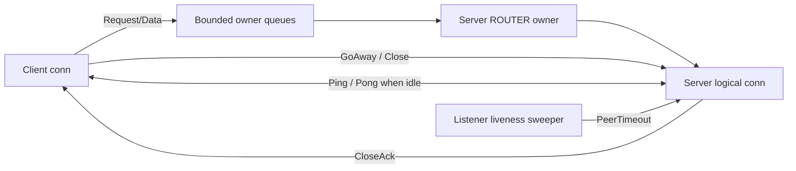

# ZeroMQ 连接生命周期与背压整改设计

日期：2026-07-16

## 1. 背景

当前 v1 ZeroMQ transport 已使用 ROUTER/DEALER、单 owner goroutine、有限 HWM、
`RecvQueueSize` 和 stream window update，但仍存在以下问题：

- 服务端处理完成后没有统一关闭接受到的 transport stream，`conn.streams` 会持续增长。
- 客户端关闭 DEALER 时没有通知服务端，服务端逻辑 conn 和 `serveConn` goroutine 无法及时回收。
- `SendQueueSize` 只限制 `sendCh`，owner 将请求转移到无界 `pending` 后会绕过限制。
- 接收队列溢出产生的 reset 通过一次性 `sendNow` 发送，`EAGAIN` 时会被静默丢弃。
- `Drain` 只限制本地主动建流，仍可能接受对端在 Drain 后发送的新 `FrameRequest`。
- `docs/zeromq-review.md` 混合旧 broker 架构和当前 v1 状态，存在互相矛盾的说明。

本设计在不兼容旧线协议的前提下，统一解决连接生命周期、异常断连检测、stream
所有权、owner 发送队列硬边界和错误传播问题。

## 2. 目标与非目标

### 2.1 目标

- 正常关闭时，客户端和服务端都能确认关闭并及时回收 conn、stream 和等待 goroutine。
- 进程崩溃或网络中断时，在有限时间内发现失活 peer 并回收服务端 route。
- 有效业务流量可以替代心跳，活跃连接不发送额外 Ping/Pong。
- Drain 后不再接受任何新 stream，已有 stream 可以完成。
- owner 中所有已准入数据请求都受 frame 数和编码字节数上限约束。
- Reset、WindowUpdate、Close 和心跳等控制帧拥有独立的有界高优先级通道。
- 所有关闭、超时、队列满和路由失败路径都有确定错误和测试。
- 当前 ZeroMQ 文档只描述实际存在的 v1 设计和限制。

### 2.2 非目标

- 不提供旧节点与新节点的滚动升级兼容。
- 不实现自动 RPC retry、请求去重或跨节点容错。
- 不实现客户端连接池、动态 resolver watch 或 least-inflight balancer。
- 不重构 codec、typed API 或 handler 注册方式。
- 不在本次整改中优化 frame clone 和 buffer pool。

## 3. 总体架构

采用“显式控制帧 + 活动感知心跳”的混合方案：



正常关闭和排空通过控制帧表达；异常断连通过最后一次有效入站活动时间检测。业务
Request、Response、Data、WindowUpdate 等有效 frame 都刷新连接活跃时间，因此高频
RPC 和 stream 不产生额外心跳包。

## 4. 线协议

### 4.1 新增和保留的控制帧

`protocol.FrameType` 增加以下类型：

- `FramePong`：响应 `FramePing`。
- `FrameClose`：请求立即关闭逻辑连接。
- `FrameCloseAck`：确认 `FrameClose` 已被接收。

保留并实现现有 `FrameGoAway`，用于进入 Drain。

控制帧使用 `Frame.Seq` 关联请求与响应：

```text
FramePing(seq=N)      -> FramePong(seq=N)
FrameClose(seq=N)     -> FrameCloseAck(seq=N)
FrameGoAway(seq=N)
```

协议校验规则：

- Ping、Pong、Close、CloseAck 和 GoAway 不要求 `StreamID`。
- Ping、Pong、Close 和 CloseAck 的 `Seq` 必须大于 0。
- Pong 和 CloseAck 必须与当前待确认请求的 Seq 匹配。
- 连接级控制帧不得携带业务 payload、metadata、window 或 status。
- 关闭后的业务 frame、未知控制 Seq 和非法状态转换属于协议错误。

### 4.2 队列分类

```text
controlCh:
  Reset, WindowUpdate, GoAway, Close, CloseAck, Ping, Pong

dataCh:
  Request, Data, Response
```

WindowUpdate 必须进入控制队列。否则数据队列满时窗口更新也会被阻塞，发送端无法
释放窗口并形成流控死锁。

## 5. 连接状态机

每条逻辑连接分别记录本地和对端状态：

```go
type lifecycleState uint8

const (
	stateActive lifecycleState = iota + 1
	stateDraining
	stateClosing
	stateClosed
)

type connLifecycle struct {
	local lifecycleState
	peer  lifecycleState
}
```

行为矩阵：

| 状态 | OpenStream | 新入站 FrameRequest | 已有 stream |
| --- | --- | --- | --- |
| Active | 允许 | 允许 | 正常运行 |
| Local Draining | 拒绝 | Reset(Unavailable) | 允许完成 |
| Peer Draining | 拒绝 | 协议上不应再出现 | 允许完成 |
| Closing | 拒绝 | 拒绝 | 立即终止 |
| Closed | closed error | 丢弃 | 已全部回收 |

### 5.1 Drain

`Drain(ctx)` 执行以下步骤：

1. 在 conn 锁内将本地状态从 Active 改为 Draining。
2. 发送 `FrameGoAway`，发送操作受 ctx 控制。
3. Drain 前已经加入 `incoming` 的 stream 仍可被 `AcceptStream` 取走。
4. Drain 后到达的新 `FrameRequest` 返回 `Unavailable` reset。
5. 收到对端 GoAway 后将 peer 标记为 Draining，后续 `OpenStream` 返回 Unavailable。

Drain 只停止新流量，不主动终止已有 stream。优雅停机调用顺序为：

```text
Drain -> 等待 active streams 为 0 -> Close
```

### 5.2 正常 Close

`Close(ctx)` 是幂等并发操作：

1. 第一个调用将本地状态改为 Closing，其他调用等待同一个完成结果。
2. 唤醒 `AcceptStream` 和 `RecvFrame`，终止本地已有 stream。
3. 发送 `FrameClose(seq)` 并等待匹配的 `FrameCloseAck(seq)`。
4. 等待上限取调用方 ctx deadline 与 `CloseHandshakeTimeout` 中更早者。
5. 收到 Ack、等待超时或 owner 失败后关闭本地 socket/context。
6. 调用方 ctx 先超时时仍完成本地资源释放，但向调用方返回 `ctx.Err()`；内部关闭握手
   超时时返回明确的 close handshake timeout error。

收到 `FrameClose` 的一端：

1. 将 peer 标记为 Closing，拒绝后续业务 frame。
2. 关闭该 conn 的全部 stream，并唤醒等待中的 `AcceptStream`。
3. 通过高优先级控制队列发送匹配的 `FrameCloseAck`。
4. Ack 完成或失败后删除 listener route，使 `serveConn` 退出。
5. Ack 完成前保留 route 项，避免相同 identity 被创建为第二条逻辑连接。

### 5.3 异常断连

心跳超时不执行 Close/Ack，直接 fail-closed：

- 关闭全部 stream。
- 从 listener 删除对应 route。
- 唤醒 `AcceptStream` 和上层 `serveConn`。
- 客户端同时关闭 owner/socket；服务端只关闭共享 ROUTER 上的逻辑 conn。

## 6. 活动感知心跳

建议默认值：

```go
HeartbeatInterval:     10 * time.Second
PeerTimeout:           30 * time.Second
CloseHandshakeTimeout: 5 * time.Second
```

要求 `PeerTimeout >= 2 * HeartbeatInterval`。

每条 conn 保存原子或锁保护的 `lastRecvAt`。只有成功解码并通过协议校验的入站 frame
才能刷新该时间。发送成功不能刷新活跃时间，因为 ZeroMQ send 成功只表示消息进入
本地或底层队列，不能证明对端已经处理。

心跳算法：

1. 收到任意有效业务或控制 frame 时更新 `lastRecvAt`。
2. `now-lastRecvAt < HeartbeatInterval` 时不发送 Ping。
3. 达到 HeartbeatInterval 且当前没有未完成 Ping 时发送 `FramePing(seq)`。
4. Ping 之后收到的任意有效 frame 都能证明 peer 存活并清除 pending Ping。
5. 没有业务 frame 时，peer 使用相同 Seq 返回 Pong。
6. `now-lastRecvAt >= PeerTimeout` 时关闭连接。

服务端 listener 使用一个 ticker 扫描全部 route，不为每个 conn 创建心跳 goroutine。
每个客户端 socket 由 owner loop 维护一个心跳定时源。

## 7. Stream 所有权和回收

- `server.serveConn` 接受 stream 后，处理 goroutine 负责最终调用 `stream.Close`。
- unary 在响应发送完成或失败后关闭服务端 transport stream。
- streaming 在 handler 返回并发送 FrameEnd 或 Reset 后关闭 transport stream。
- 客户端继续负责关闭自己创建的 stream。
- 双方独立回收本地 stream，不依赖远端调用 Close。
- Reset、队列溢出、连接关闭都复用幂等的 `stream.closeLocal` 和 `conn.removeStream`。

该所有权规则保证长连接连续执行 RPC 后，两端 `conn.streams` 都能回到零。

## 8. Owner 发送队列

### 8.1 配置

```go
SendQueueSize    int   // 默认 1024，覆盖 channel 和 pending 的总 frame 数
SendQueueBytes   int64 // 默认 64 MiB
ControlQueueSize int   // 默认 128
```

零值使用上述默认值。负数队列大小、负数字节预算、负数时间参数以及
`PeerTimeout < 2*HeartbeatInterval` 返回配置错误，不允许因 `make(chan, -1)` 导致
panic。`CloseHandshakeTimeout` 必须大于零或使用零值默认值。

### 8.2 不变量

- frame 在准入前完成校验、clone 和 msgpack 编码，预算使用真实编码字节数。
- 数据请求先获取 frame token 和 byte budget，再进入 `dataCh`。
- 控制请求先获取独立 control token，再进入 `controlCh`；该 token 覆盖 channel 和
  EAGAIN head 的总量。
- 请求从 channel 转为当前 EAGAIN head 后仍占用预算。
- 请求成功、最终失败或在发送前取消后才释放预算。
- 每类队列最多保留一个 EAGAIN head，不保留无界 `pending` slice。
- 控制队列有独立容量，普通数据打满时仍能发送控制帧。
- owner 每处理最多 8 个控制帧后尝试处理一个数据帧，避免数据饥饿。
- owner 内部生成控制帧时不得阻塞自己；控制队列满则关闭相关 conn 并记录错误。

### 8.3 接收队列溢出

```text
stream queue full
  -> stream 标记 closing
  -> Reset(ResourceExhausted) 进入 controlCh
  -> reset 发送完成或最终失败
  -> stream 从 conn.streams 删除
```

不再从 `recvAvailable` 直接调用并忽略 `sendNow` 结果。

## 9. 错误语义

| 场景 | 对外错误/状态 | 资源动作 |
| --- | --- | --- |
| 队列、窗口、消息大小超限 | ResourceExhausted | stream reset 或发送等待 |
| Drain/GoAway 后新建 stream | Unavailable | 拒绝新 stream |
| 已关闭对象上的本地误用 | FailedPrecondition | 不发送 frame |
| route 丢失、心跳超时、socket 失败 | Unavailable | 关闭对应 conn |
| 用户 context 取消或超时 | 原始 context error | 释放未发送预算 |
| 非法控制帧或错误 Seq | Internal | reset；严重时关闭 conn |

具体发送行为：

- EAGAIN 是暂时错误，保留有界 head 并重试。
- ROUTER mandatory 返回不可路由错误时，关闭并删除对应服务端逻辑 conn。
- socket/poll fatal error 失败所有排队请求，关闭 owner 并通知关联 conn。
- reset/control 最终发送失败时本地资源仍然回收，对端通过 socket 失败或心跳超时回收。

## 10. 可观测性

通过现有 metrics transport event 能力暴露：

- active connections、active streams。
- data/control queue depth。
- pending send bytes。
- queue rejected frames。
- heartbeat ping/pong 和 peer timeout。
- close/goaway/reset。
- route unavailable 和 socket fatal error。

指标不能改变控制路径正确性；collector 失败或为空不能阻塞 owner。

## 11. 测试策略

### 11.1 协议测试

- 控制帧的 StreamID、Seq 和空 payload 约束。
- Pong/CloseAck Seq 匹配。
- 非法状态转换和关闭后业务 frame。

### 11.2 生命周期测试

- 大量连续 unary 后服务端 `conn.streams` 为零。
- 正常 handler、handler error、Reset 都回收 transport stream。
- 正常 Close 后服务端 route 删除且 `serveConn` 退出。
- 客户端异常退出后在 PeerTimeout 内回收 route。
- 并发 Close 只发送一个 Close，所有调用得到一致结果。
- CloseAck 丢失时，Close 在 CloseHandshakeTimeout 内完成本地回收并返回超时错误。
- Drain 前 stream 可完成，Drain 后 stream 返回 Unavailable。
- CloseAck 完成前相同 identity 不创建第二条 conn。

### 11.3 心跳测试

- 持续 unary 和 stream 活动时不发送 Ping。
- 长 handler 期间 Ping/Pong 保持连接。
- 完全空闲时触发 Ping/Pong。
- 丢弃 Pong 和业务 frame 后触发 PeerTimeout。
- malformed frame 不刷新 lastRecvAt。

### 11.4 队列测试

- channel 与 EAGAIN head 的总数不超过 SendQueueSize。
- 编码字节数不超过 SendQueueBytes。
- 数据队列满时控制帧仍能发送。
- 持续 EAGAIN 不增长 pending 或泄漏 budget。
- context 取消释放预算并唤醒后续发送者。
- 不可路由 identity 关闭对应 conn。
- 非法 Options 返回 error，不发生 panic。

### 11.5 验收

```shell
rtk go test ./...
rtk go test -race ./...
rtk go vet ./...
```

短时压力测试覆盖长连接连续 unary、客户端反复连接/断开、慢消费者和持续 EAGAIN。
测试结束后连接数、stream 数、队列深度和 goroutine 数必须回到稳定基线。

## 12. 文档整改

重写 `docs/zeromq-review.md`：

- 删除旧 broker、PUB/SUB 和 Pack.Stage 审查内容。
- 只保留当前 v1 拓扑、能力、已知限制和整改状态。
- 更新 Options 默认值、连接状态机、活动感知心跳和队列不变量。
- 文档与实现、测试在同一提交中更新。
- 将该文档纳入版本控制，避免继续与代码演进脱节。

## 13. ADR：选择显式控制帧和活动感知心跳

### 状态

已确认。

### 决策

正常生命周期使用 GoAway、Close 和 CloseAck；异常断连使用活动感知 Ping/Pong 和
PeerTimeout。有效业务入站 frame 等价于存活证明。

### 备选方案

- 仅控制帧：实现简单，但进程崩溃和网络中断仍会泄漏服务端 route。
- 仅 ZeroMQ monitor：能发现 socket 事件，但 ROUTER 事件难以稳定映射到具体 identity，
  且无法表达 RPC Drain 和 CloseAck 语义。

### 影响

正面影响：生命周期语义完整、跨 transport 可复用、行为可确定测试，活跃连接没有
额外心跳流量。

负面影响：协议新增控制帧；listener 和客户端 owner 增加定时扫描；关闭和队列状态机
比当前实现复杂。由于明确不兼容旧线协议，不需要能力协商和降级分支。

## 14. ADR：使用双有界队列和准入预算

### 状态

已确认。

### 决策

业务数据和控制帧使用独立有界队列。数据队列同时按 frame 数和编码字节数准入；控制
队列使用独立 frame token。预算在请求最终完成前持续占用，因此 channel 被 owner
drain 后也不能绕过上限。

### 备选方案

- 只限制 channel 容量：改动最小，但请求转移到 pending 后失去上限，不满足硬边界。
- 所有 frame 共用一条队列：实现简单，但数据积压会阻塞 Reset、WindowUpdate 和 Close，
  可能造成流控死锁和连接无法回收。

### 影响

正面影响：队列内存有确定边界，控制帧在数据饱和时仍可推进状态机。

负面影响：owner 需要维护两套准入和公平调度；frame 必须在准入前编码才能执行精确
字节计费。
